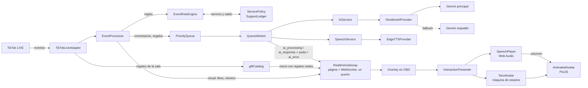

# 🔮 Generador Automático de Lives de TikTok — Avatar de Tarot con IA

Avatar animado de un **mago de tarot** que responde **en vivo y con voz** a los comentarios, regalos y seguidores de un LIVE de TikTok. Usa **Gemini** para generar las respuestas, **Edge TTS** para la voz y **PixiJS** para animar al personaje en OBS.

> **Estado:** MVP funcional, probado en LIVEs reales. **Lo más urgente es la estabilidad de la IA**: la capa gratis de Gemini se agota en minutos. Todo lo pendiente, en orden y con criterio de "listo", está en [docs/STATUS.md](docs/STATUS.md).

---

## ✨ Qué hace

| Situación en el LIVE | Reacción del mago |
|---|---|
| Alguien pregunta **sin haber regalado** | Una respuesta **corta y sin cartas**, una vez cada 24 h por persona. Las siguientes preguntas no se responden (y no gastan IA) |
| Alguien pregunta **después de regalar** | Según lo regalado, una **lectura con cartas 3D**: salen de la bola, se barajan, se revelan una a una y flotan mientras habla |
| Llega un **regalo** o una suscripción | Explosión de estrellas + pose de **agradecimiento** + agradece por nombre, y entra a la tabla de **últimos en apoyar** |
| Alguien **sigue** o **comparte** el LIVE | Celebración visual (sin gastar IA) |
| Un comentario normal | Pose de **explicación** y responde |
| La IA invita a compartir | Pose de **brazos abiertos** |
| Mientras la IA piensa | Pose de **concentración** con energía en la bola |

- **Menú de regalos en pantalla** con la imagen y el precio **reales** de los regalos de TikTok de esa sala.
- **Se ve igual en cualquier pantalla:** el overlay es un escenario 9:16 que se escala entero (OBS, celular o monitor).
- **Respuestas en orden:** si llegan muchos comentarios, se responden de a uno, sin cortar la respuesta en curso.
- **La boca sigue el volumen real de la voz**, cuadro a cuadro.
- **Tolerante a fallos:** si el modelo principal de Gemini falla, usa uno de respaldo. Si la voz falla, responde igual en texto.
- **Costo cero:** capa gratis de Gemini + voz de Edge TTS (ver [límites](#-límites-y-costos)).

---

## 📋 Requisitos

| Requisito | Versión | Notas |
|---|---|---|
| [Node.js](https://nodejs.org/) | **≥ 20.6** (probado en 24.18) | Se necesita `--env-file`, disponible desde la 20.6 |
| npm | incluido con Node | |
| Clave de API de Gemini | gratis | [aistudio.google.com/apikey](https://aistudio.google.com/apikey) |
| Cuenta de TikTok **transmitiendo en vivo** | — | La conexión falla si la cuenta no está en LIVE |
| [OBS Studio](https://obsproject.com/) | 30+ recomendado | Probado con navegador tipo Chromium. TikTok LIVE Studio **aún no está probado** |
| Navegador / GPU con WebGL | — | Sin WebGL se usa automáticamente el avatar estático |

Probado en **Windows 11**. No hay dependencias nativas, así que debería funcionar en macOS y Linux (no verificado).

---

## 🚀 Instalación

```bash
# 1. Descargar
git clone https://github.com/rslcia11/GeneradorAutomaticoLivesTiktok.git
cd GeneradorAutomaticoLivesTiktok

# 2. Instalar dependencias
npm install

# 3. Configurar variables de entorno
cp .env.example .env        # En Windows (PowerShell): Copy-Item .env.example .env
```

Edita `.env` y coloca tu clave:

```ini
GEMINI_API_KEY=tu_clave_de_gemini_aqui

# Voz (opcional)
# TTS_ENABLED=true            # false = sin voz
# TTS_VOICE=es-MX-JorgeNeural # cualquier voz "xx-XX-NombreNeural" de Edge
# TTS_RATE=default            # ej. -8%
# TTS_PITCH=default           # ej. -12%
```

> 🔐 **Nunca subas tu `.env`.** Ya está en `.gitignore`. `.env.example` debe tener **solo valores de ejemplo**.

### Tus datos de tarotista (opcional)

Crea `streamer.config.json` en la raíz. **No se sube a git**: es para tus datos, no para claves.

```json
{
    "tiktokUsername": "tu_usuario_sin_arroba",
    "contact": {
        "enabled": true,
        "text": "✨ ¿Quieres una consulta personalizada? Escríbeme al 09XXXXXXXX",
        "phone": "09XXXXXXXX",
        "visibleSeconds": 12,
        "everyMinutes": 6
    },
    "promo": {
        "enabled": true,
        "text": "🎁 Regala una Rosa y pregunta"
    }
}
```

- `contact.text` es la **franja** que aparece 15 s después de abrir el overlay y se repite cada `everyMinutes`.
- `contact.phone` es el **cartel fijo** "Consulta privada" de la esquina inferior. Sin teléfono, el cartel no existe.
- `promo.text` es la pastilla fija de promoción.
- Con `"enabled": false` no se muestra nada de ese bloque.

Cualquiera de estos valores se puede pasar también por `.env` (`TIKTOK_USERNAME`, `CONTACT_TEXT`, `CONTACT_PHONE`, `PROMO_TEXT`…), y el `.env` manda sobre el archivo.

> 🔐 El teléfono y el usuario **nunca** van escritos en el código: solo aquí o en `.env`, que no se suben a git.

> ⚠️ TikTok suele penalizar sacar usuarios de la plataforma con fines comerciales. Si notas advertencias o menos alcance, apaga el contacto.

### Cuenta de TikTok

Es obligatoria: `TIKTOK_USERNAME` en `.env` o `tiktokUsername` en `streamer.config.json`, **sin la @**. Sin ella la app no arranca y lo dice claro.

---

## ▶️ Uso

Un solo comando: el backend sirve también la página del overlay.

```bash
npm start
```

Deberías ver:

```text
✅ Overlay y WebSocket escuchando en http://127.0.0.1:8080
🖥️  Overlay para OBS: http://127.0.0.1:8080/?avatar=animado
✅ TikTok conectado
🗣️ Voz: es-MX-JorgeNeural
```

> ⚠️ El overlay **no funciona abriendo `index.html` con doble clic** (`file://`): usa módulos ES y el navegador los bloquea. Siempre ábrelo por la URL que imprime `npm start`.

Para entregárselo a un tarotista **sin que abra una terminal**, se aloja en un servidor y recibe solo una URL: ver [docs/DEPLOY.md](docs/DEPLOY.md). Si defines `OVERLAY_KEY` en `.env` (genera una con `node scripts/make-key.js`), la URL exige `&key=...` también en local, igual que en el servidor.

### Configurar OBS

1. **Fuentes → + → Navegador**.
2. **URL:** `http://127.0.0.1:8080/?avatar=animado`
3. **Ancho × Alto:** `1080 × 1920` (vertical, formato TikTok).
4. ✅ Marca **"Controlar audio mediante OBS"**. Sin esto, **la voz no sale en el stream**.
5. Después de actualizar el proyecto, usa **"Actualizar caché de la página actual"**.

### Parámetros de la URL del overlay

| Parámetro | Efecto |
|---|---|
| `?avatar=animado` | Avatar animado con WebGL (recomendado). Sin él se ve el avatar estático |
| `&fps=30` | Limita los FPS, para PCs modestas |
| `&musica=7` | Volumen de la música de fondo, **en por ciento** (0 la apaga). Por defecto 7 % |
| `&debug=1` | Métricas (FPS, ms/frame, estado, pose) y teclas de prueba |
| `&debug=anchors` | Además dibuja las zonas del rig de animación |
| `&preview=tarot` | Ejecuta una acción al cargar: `idle`, `listening`, `thinking`, `speaking`, `tarot`, `thanks`, `invite`, `reacting`, `gift` |

**Teclas con `debug`:** `1` reposo · `2` escuchando · `3` pensando · `4` comentario · `5` reaccionando · `6` lectura de tarot · `7` agradecer · `8` invitar · `g` regalo.

> En un navegador normal (no OBS), **haz un clic en la página** para habilitar el audio.

---

## 🏗️ Arquitectura



### Flujo de una interacción

1. **TikTok → reglas:** `EventRuleEngine` decide qué hacer con cada evento:
   - `ignore`: miembros, comentarios vacíos, combos de regalo aún en curso.
   - `visual`: likes, espectadores, follows, shares y fin del live. Se celebran en pantalla, **sin IA**.
   - Van a la cola de IA: comentarios con prioridad 50; regalos y suscripciones con prioridad 80.
2. **Regalos → servicio:** `ServicePolicy` suma las monedas de cada regalo al saldo del espectador. Al responderle, **gasta** el costo del mejor servicio que su saldo alcance; el sobrante queda para después y vence a las 24 h. Sin saldo, cada persona tiene **una** respuesta corta cada 24 h, y las siguientes preguntas se descartan antes de llamar a la IA.
3. **Cola → IA:** `QueueWorker` toma el evento de mayor prioridad y avisa al overlay (`ai_processing`), que pone al mago a "pensar". Después pide la respuesta a Gemini.
4. **Salida estructurada:** Gemini devuelve JSON `{ intent, text }`. La intención es `tarot_reading`, `thanks`, `comment` o `invite_share`; los regalos siempre se tratan como `thanks`.
5. **Voz:** `SpeechService` genera el MP3 con Edge TTS. Si falla, la respuesta sigue sin audio.
6. **Overlay:** `InteractionPresenter` muestra las interacciones **de una en una**:
   - El mago cambia a la pose de la intención.
   - Si la intención es `tarot_reading`, salen las cartas.
   - Suena la voz y la interacción dura lo que dura el audio.

### Estructura del proyecto

```text
src/
├── app.js                    # Punto de entrada: compone todo el backend
├── tiktok/TikTokLiveAdapter  # Normaliza eventos de tiktok-live-connector
├── events/EventProcessor     # Aplica reglas y encola
├── config/streamerConfig     # Preferencias del tarotista (frase, teléfono)
├── rules/                    # EventRuleEngine (qué hacer) + PriorityQueue
│   ├── serviceCatalog        # Los servicios y su precio en monedas
│   ├── SupportLedger         # Saldo de cada espectador (24 h)
│   ├── ServicePolicy         # Qué recibe cada quien; cobra y devuelve
│   └── giftCatalog           # Regalos REALES de la sala (imagen y precio)
├── workers/QueueWorker       # Procesa la cola de a un elemento
├── ai/                       # AIService, ResilientAIProvider, GeminiProvider, intents
├── tts/                      # SpeechService + EdgeTTSProvider
├── realtime/RealtimeGateway  # WebSocket hacia el overlay (solo 127.0.0.1)
├── overlay/                  # Web servida en OBS (vanilla ES modules, sin build)
│   ├── overlay.js            # Router de eventos y orquestación de la escena
│   ├── stage.js              # Escenario fijo 9:16, escalado a la ventana
│   ├── hud.js                # Menú de regalos, donantes y franja de contacto
│   ├── InteractionPresenter  # Orden y duración de cada interacción
│   ├── TarotAvatar           # Máquina de estados: idle/listening/thinking/speaking/reacting
│   ├── SpeechPlayer          # Reproduce la voz y mide su volumen
│   ├── debugTools            # Teclas y ?preview
│   ├── animated/             # Renderer PixiJS: poses, rig de deformación, efectos
│   │   ├── cardGeometry      # Proyección 3D de una carta (matemática pura)
│   │   ├── cardChoreography  # Los 5 actos de una lectura (matemática pura)
│   │   ├── cardArt           # Los 14 arcanos, dibujados por código
│   │   └── tarotCards        # Arma las cartas en PixiJS con lo anterior
│   ├── assets/               # Imagen del mago + poses (WebP)
│   └── vendor/               # PixiJS 8.20.1 (incluido, sin CDN)
└── test-*.js                 # Pruebas (node:assert, sin framework)
scripts/
├── serve-overlay.js          # Servidor estático del overlay
└── test-offline.js           # Ejecuta solo las pruebas offline
tools/
└── capture-overlay.mjs       # Captura el overlay en OBS, celular y monitor
docs/
├── CONTEXT.md                # Glosario del dominio
└── STATUS.md                 # Estado, pendientes y próximos pasos
```

### Decisiones técnicas clave

| Decisión | Por qué |
|---|---|
| **Overlay sin framework ni build** | Carga directa en OBS, cero tooling y fácil de depurar |
| **PixiJS incluido en `vendor/`** | Funciona sin internet y sin depender de un CDN durante el LIVE |
| **Poses como imágenes completas** (no un títere por piezas) | La IA mantiene la identidad del personaje al redibujar una pose. Al separar piezas cambiaba su diseño. Una pose nueva = 1 imagen + 1 línea en `poses.js` |
| **Todas las poses comparten una malla** | Respiración, boca y parpadeo se aplican igual a cualquier pose |
| **Audio en base64 dentro de `ai_response`** | El texto y la voz llegan juntos y en orden por el mismo canal |
| **Proveedores detrás de interfaces** | `generate()` para IA y `synthesize()` para voz: cambiar Gemini o Edge TTS toca un solo archivo |
| **WebSocket solo en `127.0.0.1`** | Nadie de la red local puede conectarse ni saturar la memoria con audio |
| **Escenario fijo 9:16 escalado** | Con medidas relativas a la ventana, los paneles se agrandaban y se encimaban en un monitor horizontal. Ahora se ve igual en OBS, en un celular y en el navegador |
| **Coreografía y proyección de las cartas como matemática pura** | Es lo que más se retoca a ojo; separado de PixiJS se prueba en Node, sin navegador |
| **Arcanos dibujados con trazos, no con glifos de fuente** | Un `☾` o un `♔` se ve como un cuadro vacío en una PC sin esa fuente, en pleno LIVE |
| **Precios de regalos leídos de la sala** | Cambian según el país: escritos a mano, el menú mentiría |

---

## 🧪 Pruebas

```bash
npm test
```

Ejecuta las **20 suites offline** (288 pruebas) sin red y sin costo. Algunas simulan el navegador (`AudioContext`) y la librería de voz.

> ⚠️ **No ejecutes `node src/test-*.js` con comodín.** Hay suites que usan servicios reales y se corren a mano, a propósito:
> - `test-adapter.js`: se conecta a un LIVE de TikTok.
> - `test-gemini.js` y `test-gemini-models.js`: **consumen cuota** de Gemini.
> - `test-realtime.js` y `test-ai-overlay.js`: levantan el WebSocket en el puerto 8080 para probar el overlay a mano.

### Verificar el overlay en varias pantallas

```bash
node tools/capture-overlay.mjs
```

Abre Chrome sin ventana y guarda una captura del overlay en OBS (1080 × 1920), celular (390 × 844) y monitor horizontal (1365 × 648), con datos de ejemplo, en `tools/capturas/`. Corta el WebSocket a propósito para **no** conectarse nunca al LIVE real del streamer.

---

## 💸 Límites y costos

| Servicio | Costo | Límite real observado |
|---|---|---|
| Gemini (capa gratis) | $0 | **Muy bajo**: en un LIVE real se agotó a los pocos minutos (≈ 20 solicitudes en `gemini-3.6-flash`). Ver pendientes |
| Edge TTS | $0 | Servicio **no oficial** de Microsoft: puede cambiar o cortarse sin aviso. Si falla, el bot responde sin voz (`TTS_ENABLED=false` lo apaga) |
| Imágenes de poses | $0 | Generadas con Qwen-Image-Edit (Apache 2.0) en Hugging Face |

---

## 📄 Licencias de terceros

| Componente | Licencia |
|---|---|
| [tiktok-live-connector](https://github.com/zerodytrash/TikTok-Live-Connector) | **AGPL-3.0** ⚠️ |
| [PixiJS](https://pixijs.com/) | MIT |
| [ws](https://github.com/websockets/ws) | MIT |
| [node-edge-tts](https://github.com/SchneeHertz/node-edge-tts) | MIT |
| Modelo Qwen-Image-Edit (arte de poses) | Apache 2.0 |

> ⚠️ **Licencia del proyecto pendiente de definir.** `tiktok-live-connector` es **AGPL-3.0**, lo que condiciona cómo se puede distribuir el producto. Ver [docs/STATUS.md](docs/STATUS.md).

---

## 🛠️ Problemas comunes

| Síntoma | Causa / solución |
|---|---|
| `UserOfflineError` al iniciar | La cuenta de TikTok **no está en LIVE**. Inicia la transmisión y vuelve a ejecutar `npm start` |
| El overlay dice **"Desconectado"** | El backend no está corriendo, o el puerto 8080 está ocupado |
| No se escucha la voz en el stream | Marca **"Controlar audio mediante OBS"** en la fuente de navegador |
| No se escucha en el navegador | Haz clic en la página (el navegador bloquea el audio hasta interactuar) |
| `You exceeded your current quota` | Se agotó la capa gratis de Gemini. Espera, o usa otra clave o modelo |
| Pantalla en blanco al abrir `index.html` | Se abrió con `file://`. Usa la URL que imprime `npm start` |
| "Falta la clave del overlay" | Tienes `OVERLAY_KEY` en `.env`: agrega `&key=...` a la URL |
| El puerto 8080 está ocupado | En PowerShell: `$env:GATEWAY_PORT=8090; npm start`, y cambia el puerto en la URL de OBS |
| El mago no se anima | Falta `?avatar=animado` en la URL, o no hay WebGL (revisa la consola) |

---

## 🤝 Contribuir

1. Lee [docs/CONTEXT.md](docs/CONTEXT.md) (vocabulario) y [docs/STATUS.md](docs/STATUS.md) (qué falta).
2. Crea una rama: `git checkout -b feat/mi-cambio`.
3. Commits con [Conventional Commits](https://www.conventionalcommits.org/es/): `feat(tts): ...`, `fix(overlay): ...`.
4. Antes de abrir un PR: `npm test` en verde.
5. **Nunca** incluyas claves, tokens ni el archivo `.env`.
