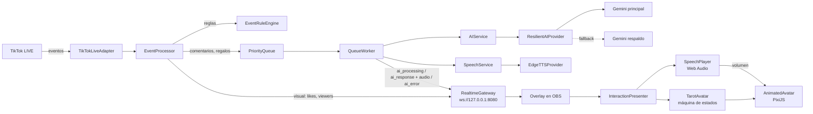

# 🔮 Generador Automático de Lives de TikTok — Avatar de Tarot con IA

Avatar animado de un **mago de tarot** que responde **en vivo y con voz** a los comentarios, regalos y seguidores de un LIVE de TikTok. Usa **Gemini** para generar las respuestas, **Edge TTS** para la voz y **PixiJS** para animar al personaje en OBS.

> **Estado:** MVP funcional, probado en un LIVE real. Ver [docs/STATUS.md](docs/STATUS.md) para lo que falta.

---

## ✨ Qué hace

| Situación en el LIVE | Reacción del mago |
|---|---|
| Alguien pregunta por el amor, el futuro, el destino | Pose de **lectura**: saca 3 cartas de tarot que flotan y se revelan, y responde con voz |
| Llega un **regalo** o una suscripción | Explosión de estrellas + pose de **agradecimiento** + agradece por nombre |
| Alguien **sigue** o **comparte** el LIVE | Celebración visual (sin gastar IA) |
| Un comentario normal | Pose de **explicación** y responde |
| La IA invita a compartir | Pose de **brazos abiertos** |
| Mientras la IA piensa | Pose de **concentración** con energía en la bola |

- **Respuestas en orden:** si llegan muchos comentarios, se responden de a uno, sin cortar la respuesta en curso.
- **La boca sigue el volumen real de la voz**, cuadro a cuadro.
- **Tolerante a fallos:** si el modelo principal de Gemini falla, usa uno de respaldo. Si la voz falla, responde igual en texto.
- **Costo cero:** capa gratis de Gemini + voz de Edge TTS (ver [límites](#-límites-y-costos)).

---

## 📋 Requisitos

| Requisito | Versión | Notas |
|---|---|---|
| [Node.js](https://nodejs.org/) | **≥ 20.6** (probado en 24.18) | Se necesita `--env-file`, disponible desde la 20.6 |
| npm | incluido con Node | |
| Clave de API de Gemini | gratis | [aistudio.google.com/apikey](https://aistudio.google.com/apikey) |
| Cuenta de TikTok **transmitiendo en vivo** | — | La conexión falla si la cuenta no está en LIVE |
| [OBS Studio](https://obsproject.com/) | 30+ recomendado | Probado con navegador tipo Chromium. TikTok LIVE Studio **aún no está probado** |
| Navegador / GPU con WebGL | — | Sin WebGL se usa automáticamente el avatar estático |

Probado en **Windows 11**. No hay dependencias nativas, así que debería funcionar en macOS y Linux (no verificado).

---

## 🚀 Instalación

```bash
# 1. Descargar
git clone https://github.com/rslcia11/GeneradorAutomaticoLivesTiktok.git
cd GeneradorAutomaticoLivesTiktok

# 2. Instalar dependencias
npm install

# 3. Configurar variables de entorno
cp .env.example .env        # En Windows (PowerShell): Copy-Item .env.example .env
```

Edita `.env` y coloca tu clave:

```ini
GEMINI_API_KEY=tu_clave_de_gemini_aqui

# Voz (opcional)
# TTS_ENABLED=true            # false = sin voz
# TTS_VOICE=es-MX-JorgeNeural # cualquier voz "xx-XX-NombreNeural" de Edge
# TTS_RATE=default            # ej. -8%
# TTS_PITCH=default           # ej. -12%
```

> 🔐 **Nunca subas tu `.env`.** Ya está en `.gitignore`. `.env.example` debe tener **solo valores de ejemplo**.

### Cuenta de TikTok

Por ahora el usuario está fijo en [src/app.js](src/app.js) (`config.tiktokUsername`). Cámbialo por tu cuenta **sin la @**. Pasarlo a `.env` está pendiente, ver [docs/STATUS.md](docs/STATUS.md).

---

## ▶️ Uso

Necesitas **dos terminales**:

```bash
# Terminal 1 — backend (conecta con TikTok, Gemini y la voz)
npm start

# Terminal 2 — servidor del overlay
npm run overlay
```

Deberías ver:

```text
✅ WebSocket escuchando en ws://127.0.0.1:8080
✅ TikTok conectado
🗣️ Voz: es-MX-JorgeNeural
🔮 Overlay: http://127.0.0.1:5500/index.html?avatar=animado
```

> ⚠️ El overlay **no funciona abriendo `index.html` con doble clic** (`file://`): usa módulos ES y el navegador los bloquea. Siempre sírvelo con `npm run overlay`.

### Configurar OBS

1. **Fuentes → + → Navegador**.
2. **URL:** `http://127.0.0.1:5500/index.html?avatar=animado`
3. **Ancho × Alto:** `1080 × 1920` (vertical, formato TikTok).
4. ✅ Marca **"Controlar audio mediante OBS"**. Sin esto, **la voz no sale en el stream**.
5. Después de actualizar el proyecto, usa **"Actualizar caché de la página actual"**.

### Parámetros de la URL del overlay

| Parámetro | Efecto |
|---|---|
| `?avatar=animado` | Avatar animado con WebGL (recomendado). Sin él se ve el avatar estático |
| `&fps=30` | Limita los FPS, para PCs modestas |
| `&debug=1` | Métricas (FPS, ms/frame, estado, pose) y teclas de prueba |
| `&debug=anchors` | Además dibuja las zonas del rig de animación |
| `&preview=tarot` | Ejecuta una acción al cargar: `idle`, `listening`, `thinking`, `speaking`, `tarot`, `thanks`, `invite`, `reacting`, `gift` |

**Teclas con `debug`:** `1` reposo · `2` escuchando · `3` pensando · `4` comentario · `5` reaccionando · `6` lectura de tarot · `7` agradecer · `8` invitar · `g` regalo.

> En un navegador normal (no OBS), **haz un clic en la página** para habilitar el audio.

---

## 🏗️ Arquitectura



### Flujo de una interacción

1. **TikTok → reglas:** `EventRuleEngine` decide qué hacer con cada evento:
   - `ignore`: miembros, comentarios vacíos, combos de regalo aún en curso.
   - `visual`: likes, espectadores, follows, shares y fin del live. Se celebran en pantalla, **sin IA**.
   - Van a la cola de IA: comentarios con prioridad 50; regalos y suscripciones con prioridad 80.
2. **Cola → IA:** `QueueWorker` toma el evento de mayor prioridad y avisa al overlay (`ai_processing`), que pone al mago a "pensar". Después pide la respuesta a Gemini.
3. **Salida estructurada:** Gemini devuelve JSON `{ intent, text }`. La intención es `tarot_reading`, `thanks`, `comment` o `invite_share`; los regalos siempre se tratan como `thanks`.
4. **Voz:** `SpeechService` genera el MP3 con Edge TTS. Si falla, la respuesta sigue sin audio.
5. **Overlay:** `InteractionPresenter` muestra las interacciones **de una en una**:
   - El mago cambia a la pose de la intención.
   - Si la intención es `tarot_reading`, salen las cartas.
   - Suena la voz y la interacción dura lo que dura el audio.

### Estructura del proyecto

```text
src/
├── app.js                    # Punto de entrada: compone todo el backend
├── tiktok/TikTokLiveAdapter  # Normaliza eventos de tiktok-live-connector
├── events/EventProcessor     # Aplica reglas y encola
├── rules/                    # EventRuleEngine (qué hacer) + PriorityQueue
├── workers/QueueWorker       # Procesa la cola de a un elemento
├── ai/                       # AIService, ResilientAIProvider, GeminiProvider, intents
├── tts/                      # SpeechService + EdgeTTSProvider
├── realtime/RealtimeGateway  # WebSocket hacia el overlay (solo 127.0.0.1)
├── overlay/                  # Web servida en OBS (vanilla ES modules, sin build)
│   ├── overlay.js            # Router de eventos y orquestación de la escena
│   ├── InteractionPresenter  # Orden y duración de cada interacción
│   ├── TarotAvatar           # Máquina de estados: idle/listening/thinking/speaking/reacting
│   ├── SpeechPlayer          # Reproduce la voz y mide su volumen
│   ├── debugTools            # Teclas y ?preview
│   ├── animated/             # Renderer PixiJS: poses, rig de deformación, cartas, efectos
│   ├── assets/               # Imagen del mago + poses (WebP)
│   └── vendor/               # PixiJS 8.20.1 (incluido, sin CDN)
└── test-*.js                 # Pruebas (node:assert, sin framework)
scripts/
├── serve-overlay.js          # Servidor estático del overlay
└── test-offline.js           # Ejecuta solo las pruebas offline
docs/
├── CONTEXT.md                # Glosario del dominio
└── STATUS.md                 # Estado, pendientes y próximos pasos
```

### Decisiones técnicas clave

| Decisión | Por qué |
|---|---|
| **Overlay sin framework ni build** | Carga directa en OBS, cero tooling y fácil de depurar |
| **PixiJS incluido en `vendor/`** | Funciona sin internet y sin depender de un CDN durante el LIVE |
| **Poses como imágenes completas** (no un títere por piezas) | La IA mantiene la identidad del personaje al redibujar una pose. Al separar piezas cambiaba su diseño. Una pose nueva = 1 imagen + 1 línea en `poses.js` |
| **Todas las poses comparten una malla** | Respiración, boca y parpadeo se aplican igual a cualquier pose |
| **Audio en base64 dentro de `ai_response`** | El texto y la voz llegan juntos y en orden por el mismo canal |
| **Proveedores detrás de interfaces** | `generate()` para IA y `synthesize()` para voz: cambiar Gemini o Edge TTS toca un solo archivo |
| **WebSocket solo en `127.0.0.1`** | Nadie de la red local puede conectarse ni saturar la memoria con audio |

---

## 🧪 Pruebas

```bash
npm test
```

Ejecuta las **14 suites offline** (183 pruebas) sin red y sin costo. Algunas simulan el navegador (`AudioContext`) y la librería de voz.

> ⚠️ **No ejecutes `node src/test-*.js` con comodín.** Hay suites que usan servicios reales y se corren a mano, a propósito:
> - `test-adapter.js`: se conecta a un LIVE de TikTok.
> - `test-gemini.js` y `test-gemini-models.js`: **consumen cuota** de Gemini.
> - `test-realtime.js` y `test-ai-overlay.js`: levantan el WebSocket en el puerto 8080 para probar el overlay a mano.

---

## 💸 Límites y costos

| Servicio | Costo | Límite real observado |
|---|---|---|
| Gemini (capa gratis) | $0 | **Muy bajo**: en un LIVE real se agotó a los pocos minutos (≈ 20 solicitudes en `gemini-3.6-flash`). Ver pendientes |
| Edge TTS | $0 | Servicio **no oficial** de Microsoft: puede cambiar o cortarse sin aviso. Si falla, el bot responde sin voz (`TTS_ENABLED=false` lo apaga) |
| Imágenes de poses | $0 | Generadas con Qwen-Image-Edit (Apache 2.0) en Hugging Face |

---

## 📄 Licencias de terceros

| Componente | Licencia |
|---|---|
| [tiktok-live-connector](https://github.com/zerodytrash/TikTok-Live-Connector) | **AGPL-3.0** ⚠️ |
| [PixiJS](https://pixijs.com/) | MIT |
| [ws](https://github.com/websockets/ws) | MIT |
| [node-edge-tts](https://github.com/SchneeHertz/node-edge-tts) | MIT |
| Modelo Qwen-Image-Edit (arte de poses) | Apache 2.0 |

> ⚠️ **Licencia del proyecto pendiente de definir.** `tiktok-live-connector` es **AGPL-3.0**, lo que condiciona cómo se puede distribuir el producto. Ver [docs/STATUS.md](docs/STATUS.md).

---

## 🛠️ Problemas comunes

| Síntoma | Causa / solución |
|---|---|
| `UserOfflineError` al iniciar | La cuenta de TikTok **no está en LIVE**. Inicia la transmisión y vuelve a ejecutar `npm start` |
| El overlay dice **"Desconectado"** | El backend no está corriendo, o el puerto 8080 está ocupado |
| No se escucha la voz en el stream | Marca **"Controlar audio mediante OBS"** en la fuente de navegador |
| No se escucha en el navegador | Haz clic en la página (el navegador bloquea el audio hasta interactuar) |
| `You exceeded your current quota` | Se agotó la capa gratis de Gemini. Espera, o usa otra clave o modelo |
| Pantalla en blanco al abrir `index.html` | Se abrió con `file://`. Usa `npm run overlay` |
| `El puerto 5500 está ocupado` | Otro programa (p. ej. Live Server de VS Code) lo usa. En PowerShell: `$env:OVERLAY_PORT=5600; npm run overlay`, y cambia el puerto en la URL de OBS |
| El mago no se anima | Falta `?avatar=animado` en la URL, o no hay WebGL (revisa la consola) |

---

## 🤝 Contribuir

1. Lee [docs/CONTEXT.md](docs/CONTEXT.md) (vocabulario) y [docs/STATUS.md](docs/STATUS.md) (qué falta).
2. Crea una rama: `git checkout -b feat/mi-cambio`.
3. Commits con [Conventional Commits](https://www.conventionalcommits.org/es/): `feat(tts): ...`, `fix(overlay): ...`.
4. Antes de abrir un PR: `npm test` en verde.
5. **Nunca** incluyas claves, tokens ni el archivo `.env`.
